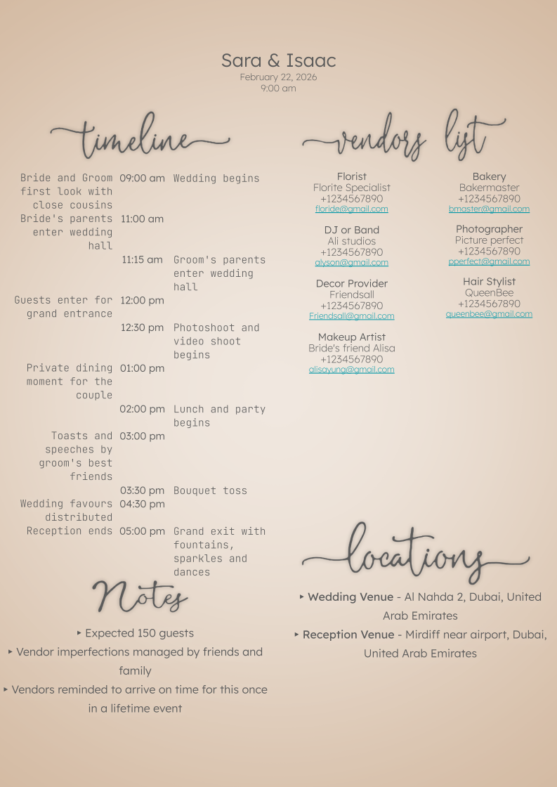

# n8n Wedding Planner PDF Automation 
Webhook → Google Sheets → n8n → Google Slides/PDF → Google Drive/Gmail

## Overview
This project automates the generation of a personalized **wedding planner PDF** based on form submissions collected through a **webhook payload**. Only the submission ID is taken from the webhook which is then mapped on the Google Sheet to get all the details from the particular row **see example links and images below**

When a user fills out the form, their responses are processed end-to-end through **Google Sheets** and **n8n**, resulting in a beautifully formatted **PDF planner** (template preview provided)

---

## 🧩 Workflow Summary

### 1. Wix Form Submission (can use any form, just the 'Submission ID' in the webhook is required)
A custom Wix form collects detailed information from users regarding their wedding day including **timeline**, **vendors**, **locations**, **notes**, and **special requests**.  
The form is clean, well-structured, and designed for an elegant user experience.

### 2. Wix Automation → Google Sheets + Webhook
Once the user submits the form:
- The form data is **automatically sent to a linked Google Sheet** via Wix’s native automation.
- In the same automation, a **Webhook** is triggered.  
  This webhook carries the entire **payload** (every question and answer) to **n8n** for further processing.

### 3. n8n Workflow (Automation Engine)
The `n8n` workflow takes over from here.  
It listens for the incoming webhook and performs the following steps:

1. **Webhook Trigger** — Receives the submission data from Wix.
2. **Google Sheets Integration** — Fetches or verifies the form entry for consistency.
3. **AI Data Processor (ChatGPT Model)** — Parses all the user answers, cleans the data, and converts them into structured JSON sections:
   - **Timeline**
   - **Vendors**
   - **Notes/Details**
   - **Locations**
   - **Wedding Name & Time**
4. **Data Formatting Scripts (Custom JavaScript Nodes)** — Splits, formats, and aligns text into **columns (left, middle, right)** depending on content type (e.g., vendors vs. timeline).
5. **Google Slides API** — Inserts the processed data into a wedding planner **Google Slides template**.  
   Each category (timeline, vendors, notes, etc.) is styled and placed in its respective text boxes.
6. **Final Export (PDF)** — The Google Slides file is used to export a finished **Wedding Planner PDF** for the client.

---

## 📁 Repository Contents
```
/public
  ├── template.png          # Example of final planner PDF layout
/workflow
  ├── wix-n8n-automation.json  # Full n8n workflow (sanitized)
README.md
```

---

## ⚙️ How It Works

| Step | Service | Description |
|------|----------|-------------|
| 1 | **Wix Form** | User fills out form → Automation triggers |
| 2 | **Wix Automation** | Sends data to Google Sheets + n8n Webhook |
| 3 | **n8n Workflow** | Parses, structures, and beautifies the data |
| 4 | **Google Slides API** | Updates predefined template with dynamic content |
| 5 | **Export** | Google Slides → PDF (final planner ready for download) |

---

## 🧠 AI-Powered Data Processing
The n8n workflow uses an **AI Agent (GPT-5)** node to intelligently transform raw form responses into a structured JSON that defines all event details neatly and consistently.

Example output (simplified):
```json
{
  "timeline": [
    { "time": "09:00 AM", "data": ["Bride gets ready"] },
    { "time": "10:30 AM", "data": ["First look with groom"] }
  ],
  "vendors": [
    { "header": "DJ or Band", "name": "DJ Megladon", "phone": "+1234567890", "email": "djmegladon@gmail.com" }
  ],
  "notes_details": [
    "Outdoor setup with floral arch",
    "Private dining for couple before reception"
  ],
  "locations": [
    { "header": "Ceremony Location", "address": "Al Qasr Ballroom, Dubai" }
  ],
  "wedding_name_time": {
    "names": "John & Doe",
    "date": "12/13/2025",
    "time": "09:00 PM"
  }
}
```

---

## 📸 Previews & References
- **Final Planner Layout:**  
  Here’s what the generated wedding planner PDF looks like:

  
- **Google Sheet Reference:**  
  A public demo sheet showing the **questions and answers** will be provided:  
  👉 [Google Sheet Sample Template](https://docs.google.com/spreadsheets/d/1nLz-K7kj8Bp5IFjLJgvLj8cLC-r2pkrV-yChMPfJaPs/view)

---

## ⚠️ Disclaimer
This workflow runs **entirely based on the data provided through the Wix form**.  
The final output depends on the completeness and accuracy of the form responses.  
Sensitive data such as API keys, refresh tokens, and client secrets have been **removed** before committing this workflow file.

---

## 🛠️ Technologies Used
- **Wix Automations**
- **Google Sheets API**
- **n8n (Open Source Automation Tool)**
- **Google Slides API**
- **OpenAI GPT-5 (via LangChain integration)**
- **JavaScript (Code Nodes in n8n)**

---

## 📜 License
This project is open-sourced under the **MIT License**.  
You are free to use, modify, and build upon this workflow for your own Wix/n8n automations.
