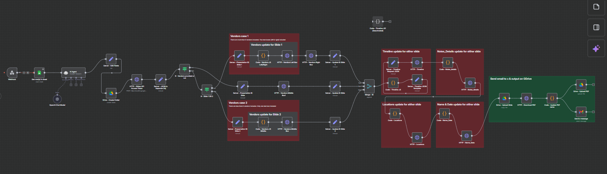
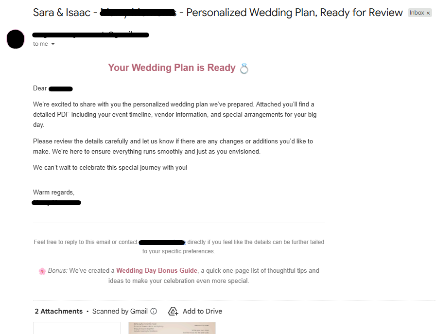

# n8n Wedding Planner PDF Automation 
Webhook → Google Sheets → n8n → Google Slides/PDF → Google Drive/Gmail

## Overview
This project automates the generation of a personalized **wedding planner PDF** based on form submissions collected through a **webhook payload**. Only the submission ID is taken from the webhook which is then mapped on the Google Sheet to get all the details from the particular row **see example links and images below**

When a user fills out the form, their responses are processed end-to-end through **Google Sheets** and **n8n**, resulting in a beautifully formatted **PDF planner** (template preview provided)

---

## Workflow Summary

### 1. Wix Form Submission (can use any form, just the 'Submission ID' in the webhook is required)
A custom Wix form collects detailed information from users regarding their wedding day including **timeline**, **vendors**, **locations**, **notes**, and **special requests**.  
The form is clean, well-structured, and designed for an elegant user experience.

### 2. Wix Automation → Google Sheets + Webhook
Once the user submits the form:
- The form data is **automatically sent to a linked Google Sheet** via Wix’s native automation.
- In the same automation, a **Webhook** is triggered.  
  This webhook carries the entire **payload** (every question and answer) to **n8n** for further processing.

### 3. n8n Workflow (Automation Engine)
The `n8n` workflow takes over from here.
It listens for the incoming webhook and performs the following steps:

1. **Webhook Trigger** - Receives the submission data from Wix.
2. **Google Sheets Integration** - Fetches or verifies the form entry for consistency.
3. **AI Data Processor (OpenAI - ChatGPT Model 5)** - Parses all the user answers, cleans the data, and converts them into structured JSON sections:
   - **Timeline**
   - **Vendors**
   - **Notes/Details**
   - **Locations**
   - **Wedding Name & Time**
4. **Data Formatting Scripts (Custom JavaScript Nodes)** - Splits, formats, and aligns text into **columns (left, middle, right)** depending on content type (e.g., vendors vs. timeline).
5. **Google Slides API** - Inserts the processed data into a wedding planner **Google Slides template**.  
   Each category (timeline, vendors, notes, etc.) is styled and placed in its respective text boxes.
6. **Final Export (PDF)** - The Google Slides file is used to export a finished **Wedding Planner PDF** for the client.

---

## AI-Powered Data Processing
The n8n workflow uses an **AI Agent (GPT-5)** node to intelligently transform raw form responses into a structured JSON that defines all event details neatly and consistently.

Example output (simplified):
```json
{
  "timeline": [
    { "time": "09:00 AM", "data": ["Bride gets ready"] },
    { "time": "10:30 AM", "data": ["First look with groom"] }
  ],
  "vendors": [
    { "header": "DJ or Band", "name": "DJ Megladon", "phone": "+1234567890", "email": "djmegladon@gmail.com" }
  ],
  "notes_details": [
    "Outdoor setup with floral arch",
    "Private dining for couple before reception"
  ],
  "locations": [
    { "header": "Ceremony Location", "address": "Al Qasr Ballroom, Dubai" }
  ],
  "wedding_name_time": {
    "names": "John & Doe",
    "date": "12/13/2025",
    "time": "09:00 PM"
  }
}
```

---

## Previews & References
- **n8n workflow:**  
  Complete n8n workflow screenshot:

  

- **Final Planner Layout:**  
  Final Wedding Planner PDF sample:

  

- **Suggestion Page Layout:**  
  Wedding suggestions PDF sample:

  
  <br />
  <a href="https://www.canva.com/design/DAG2Pp99ak8/3WrDB1LZoeQSrnFIzeDFGw/edit" target="_blank" rel="noopener noreferrer">Get suggestion page</a>

- **Email Layout:**  
  Email sample:

  

- **Google Sheet Reference:**  
  A public demo sheet showing the **questions and answers** will be provided:  
  <a href="https://docs.google.com/spreadsheets/d/1nLz-K7kj8Bp5IFjLjLgvLj8cLC-r2pkrV-yChMPfJaPs/view" target="_blank" rel="noopener noreferrer">Google Sheet Sample Template</a>

---

## Technologies Used
- **Wix Automations**
- **Google Sheets API**
- **n8n (install Node.js & use command 'npx n8n' to test locally)**
- **Google Slides API**
- **OpenAI GPT-5**
- **JavaScript (Code Nodes in n8n responsible for parsing/updating body structure of Google Slides API)**

---

## Disclaimer
- You DON'T need Wix to run this code, you can literally just add data into the google sheet manually and make a random submission ID. Use the same submission ID in the body structure on Postman and boom, you're good to go.  
- The final output depends on the completeness and accuracy of the form responses.  
- Sensitive data such as API keys, refresh tokens, and client secrets have been **removed** before committing this workflow file.
- Feel free to leave a message/contact me if you're not sure how google APIs works and how to get Access/Refresh tokens from it. It took me a while to understand it aswell # n8n Wedding Planner PDF Automation 
Webhook → Google Sheets → n8n → Google Slides/PDF → Google Drive/Gmail

## Overview
This project automates the generation of a personalized **wedding planner PDF** based on form submissions collected through a **webhook payload**. Only the submission ID is taken from the webhook which is then mapped on the Google Sheet to get all the details from the particular row **see example links and images below**

When a user fills out the form, their responses are processed end-to-end through **Google Sheets** and **n8n**, resulting in a beautifully formatted **PDF planner** (template preview provided)

---

## Workflow Summary

### 1. Wix Form Submission (can use any form, just the 'Submission ID' in the webhook is required)
A custom Wix form collects detailed information from users regarding their wedding day including **timeline**, **vendors**, **locations**, **notes**, and **special requests**.  
The form is clean, well-structured, and designed for an elegant user experience.

### 2. Wix Automation → Google Sheets + Webhook
Once the user submits the form:
- The form data is **automatically sent to a linked Google Sheet** via Wix’s native automation.
- In the same automation, a **Webhook** is triggered.  
  This webhook carries the entire **payload** (every question and answer) to **n8n** for further processing.

### 3. n8n Workflow (Automation Engine)
The `n8n` workflow takes over from here.
It listens for the incoming webhook and performs the following steps:

1. **Webhook Trigger** - Receives the submission data from Wix.
2. **Google Sheets Integration** - Fetches or verifies the form entry for consistency.
3. **AI Data Processor (OpenAI - ChatGPT Model 5)** - Parses all the user answers, cleans the data, and converts them into structured JSON sections:
   - **Timeline**
   - **Vendors**
   - **Notes/Details**
   - **Locations**
   - **Wedding Name & Time**
4. **Data Formatting Scripts (Custom JavaScript Nodes)** - Splits, formats, and aligns text into **columns (left, middle, right)** depending on content type (e.g., vendors vs. timeline).
5. **Google Slides API** - Inserts the processed data into a wedding planner **Google Slides template**.  
   Each category (timeline, vendors, notes, etc.) is styled and placed in its respective text boxes.
6. **Final Export (PDF)** - The Google Slides file is used to export a finished **Wedding Planner PDF** for the client.
7. **Google Drive Upload & Email Delivery** —  
   Once the wedding planner PDF is generated, the workflow automatically uploads it to a designated **Google Drive folder**.  
   After upload, an **email is sent** (via Gmail integration) to the client or planner containing:
   - A personalized message 
   - Generated PDF as attachment. 
   - Suggestion PDF as attachment.
   - All samples attached below

---

## AI-Powered Data Processing
The n8n workflow uses an **AI Agent (GPT-5)** node to intelligently transform raw form responses into a structured JSON that defines all event details neatly and consistently.

Example output (simplified):
```json
{
  "timeline": [
    { "time": "09:00 AM", "data": ["Bride gets ready"] },
    { "time": "10:30 AM", "data": ["First look with groom"] }
  ],
  "vendors": [
    { "header": "DJ or Band", "name": "DJ Megladon", "phone": "+1234567890", "email": "djmegladon@gmail.com" }
  ],
  "notes_details": [
    "Outdoor setup with floral arch",
    "Private dining for couple before reception"
  ],
  "locations": [
    { "header": "Ceremony Location", "address": "Al Qasr Ballroom, Dubai" }
  ],
  "wedding_name_time": {
    "names": "John & Doe",
    "date": "12/13/2025",
    "time": "09:00 PM"
  }
}
```

---

## Previews & References
- **n8n workflow:**  
  Complete n8n workflow screenshot:

  

- **Final planner layout:**  
  Final Wedding Planner PDF sample:

  

- **Suggestion page layout:**  
  Wedding suggestions PDF sample:

  
  <a href="https://www.canva.com/design/DAG2Pp99ak8/3WrDB1LZoeQSrnFIzeDFGw/edit" target="_blank" rel="noopener noreferrer">Get suggestion page</a>

  - **Email template layout:**  
  Email template sample:

  

- **Google sheet reference:**  
  A public demo sheet showing the **questions and answers** will be provided:  
  <a href="https://docs.google.com/spreadsheets/d/1nLz-K7kj8Bp5IFjLjLgvLj8cLC-r2pkrV-yChMPfJaPs/view" target="_blank" rel="noopener noreferrer">Google Sheet Sample Template</a>

---

## Technologies Used
- **Wix Automations**
- **Google Sheets API**
- **n8n (install Node.js & use command 'npx n8n' to test locally)**
- **Google Slides API**
- **OpenAI GPT-5**
- **JavaScript (Code Nodes in n8n responsible for parsing/updating body structure of Google Slides API)**

---

## Disclaimer
- You DON'T need Wix to run this code, you can literally just add data into the google sheet manually and make a random submission ID. Use the same submission ID in the body structure on Postman and boom, you're good to go.  
- The final output depends on the completeness and accuracy of the form responses.  
- Sensitive data such as API keys, refresh tokens, and client secrets have been **removed** before committing this workflow file.
- Feel free to leave a message/contact me if you're not sure how google APIs works and how to get Access/Refresh tokens from it. It took me a while to understand it aswell 🫂
- I have no clue how to code in JS. So I coded in Python and VB.NET for the core logic and manually converted the main logic into Pseudocode, gave it to chatgpt to convert it into JS code for n8n JS code blocks.
- To test out the n8n flow, make sure have Node.js installed and just run "npx n8n" in CMD. Import of the code using the json file taken from workflows/n8n - wedding planner.json. Add sensiive data i.e. API keys,. and you're good to go.

---

## 📜 License
This project is open-sourced under the **MIT License**.  
You are free to use, modify, and build upon this workflow for your own Wix/n8n automations.
